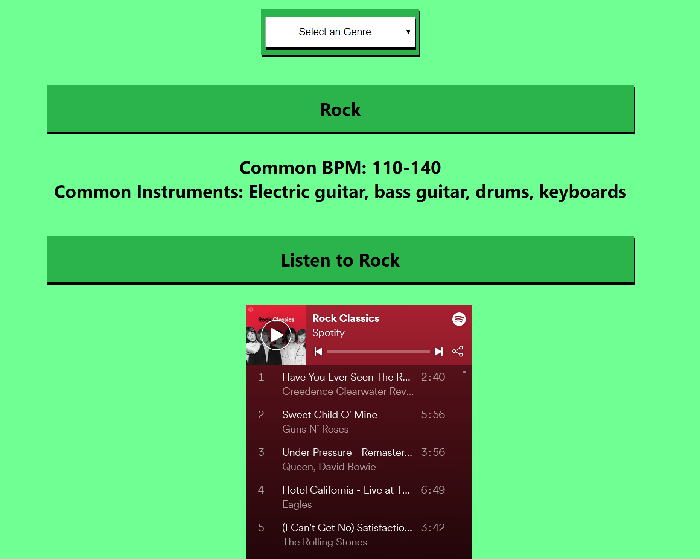
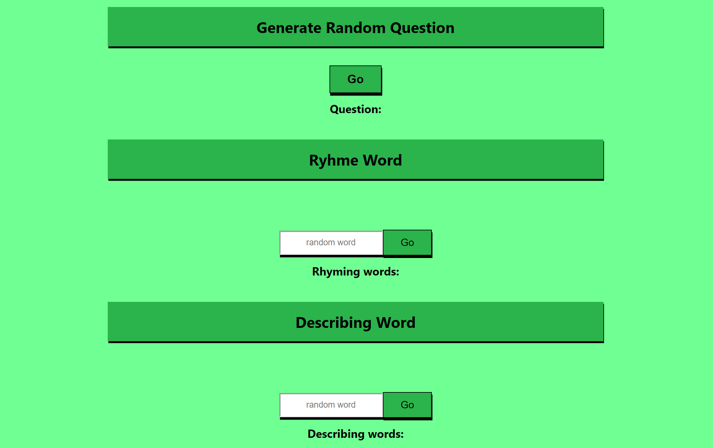

### `Producer App`

Link to live app: https://producer-app.now.sh/

### `Purpose`

The `purpose` of this app is to help `song writers` and `producers`.

The `genre page` is for producers to learn general information about a certain genre in order to make somethings similar. Spotify playlists are implemented to be able to hear each genre and get a feel for it.

The `lyrics page` is to help brainstorm lyrics. It can give you questions to help you think or rhyming or descriptive words. You can then save the lyrics you've thought of to your account.

## `Technologies Used`
HTML, CSS, React, PostgreSQL, Javascript, Express, Node and API's

## Available Scripts

In the project directory, you can run:

### `npm start`

Runs the app in the development mode. 
Open [http://localhost:3000](http://localhost:3000) to view it in the browser.

The page will reload if you make edits. 
You will also see any lint errors in the console.

### `npm test`

Launches the test runner in the interactive watch mode. 
See the section about [running tests](https://facebook.github.io/create-react-app/docs/running-tests) for more information.

### `npm run build`

Builds the app for production to the `build` folder. 
It correctly bundles React in production mode and optimizes the build for the best performance.

The build is minified and the filenames include the hashes. 
Your app is ready to be deployed!

See the section about [deployment](https://facebook.github.io/create-react-app/docs/deployment) for more information.

